# Adapter Publisher: Current State and IPFS Future

## Introduction
Welcome to the Adapter Publisher component! 👋 This document explains how our Publisher works today with local storage and how we'll transform it with IPFS for decentralized adapter distribution in Phase 5.

## Current Implementation

### The Big Picture
Currently, the Publisher follows a straightforward workflow to discover, validate, and share adapters:


- The Publisher operates like a post office for adapters:
  - `AdapterSelector`: Discovers adapter directories in the checkpoints folder
  - `AdapterValidator`: Ensures each adapter has the required files
  - `AdapterInfoExtractor`: Reads metadata from adapter configuration files
  - `AdapterUploader`: Copies files to shared storage location
  - `AdapterPublisherService`: Orchestrates the entire process and announces new adapters

### Current Data Flow
When you run the Publisher, here's what happens:


### Current Publisher Structure
Here's a detailed look at the Publisher implementation:


### Current Implementation Details

The Publisher currently works with local file system operations:

1. **Adapter Discovery**
   - Scans a local directory (`checkpointsPath`) for adapter folders
   - Looks for "best_model_adapter" as a priority adapter
   - Returns a list of available adapter directories

2. **Adapter Validation**
   - Verifies that required files exist in each adapter directory:
     - adapter_config.json
     - adapter_model.safetensors
     - metadata.pt (optional)
   - Returns true if the adapter is valid, false otherwise

3. **Metadata Extraction**
   - Reads the adapter_config.json file to extract metadata
   - Creates an AdapterInfo object with name, path, creation time, and metadata
   - Handles JSON parsing and proper type conversion

4. **Adapter Upload**
   - Copies adapter files from source path to target storage location
   - Creates necessary subdirectories in the target storage
   - Returns the path where files were stored

5. **Publisher Service**
   - Orchestrates the entire process with the other components
   - Maintains a list of published adapters
   - Provides methods to get available and latest adapters
   - Raises events when new adapters are published

## IPFS Implementation (Phase 5)

In Phase 5, we'll transform the Publisher to use IPFS (InterPlanetary File System) for decentralized adapter sharing. This implementation will follow the core IPFS principles of content-addressing, transport-agnosticism, and verification.

### IPFS Core Principles

Our IPFS implementation will adhere to the official IPFS principles:

1. **Content Addressing**: Adapters will be uniquely identified by their Content IDentifiers (CIDs), which are cryptographic hashes of the content itself rather than location references
   
2. **Transport Agnosticism**: Our implementation won't rely on any single transport protocol, ensuring flexibility across different network environments

3. **Content Verification**: We'll verify that CIDs match the content they address, guaranteeing adapter integrity

4. **Offline Capability**: Locally pinned adapters will remain available even without internet connectivity

### IPFS Architecture


- The IPFS-enabled Publisher will work like this:
  - Reuse existing `AdapterSelector`, `AdapterValidator`, and `AdapterInfoExtractor`
  - Add new `ContentAddressingSystem` to generate and verify content identifiers (CIDs)
  - Implement `AdapterPacker` to efficiently prepare adapters for IPFS storage
  - Create `IPFS Service` with a `Transport-Agnostic Layer` supporting multiple implementations:
    - `Kubo API Client` for interacting with Kubo nodes (Go implementation)
    - `Helia Integration` for JavaScript environments
    - `Direct libp2p` for direct peer-to-peer communication
  - Utilize IPFS network components:
    - `Distributed Hash Table` for content discovery
    - `PubSub System` for real-time adapter announcements
    - `Pinning Service` for persistent adapter storage
  - Add `AdapterRegistry` to catalog adapters across the IPFS network
  - Support offline access to previously downloaded adapters via their CIDs

### IPFS Data Flow

```mermaid
sequenceDiagram
    %% Participants with emoji indicators
    participant User as "👤 User"
    participant Publisher as "📤 Publisher"
    participant Training as "🐍 Python Training"
    participant CAS as "🔑 Content Addressing"
    participant Transport as "🔄 Transport Layer"
    participant IPFS as "🌐 IPFS Network"
    participant DHT as "🗂️ DHT"
    participant PubSub as "📢 PubSub"
    participant Registry as "📋 Adapter Registry"
    participant Client as "💬 Chat Client"
    
    %% Section headers with notes
    Note over Publisher, IPFS: IPFS Publisher Workflow
    
    %% Adapter Publishing Flow with IPFS
    autonumber 1
    User->>+Publisher: Run Publisher
    Publisher->>Publisher: Scan for Adapter Directories
    Publisher->>Publisher: Validate Adapter Files
    Publisher->>Publisher: Extract Adapter Metadata
    Publisher->>Publisher: Pack Adapter Files
    Note right of Publisher: Prepare for content addressing
    Publisher->>+CAS: Generate Content Identifier (CID)
    Note right of CAS: Uses SHA-256 multihash by default
    CAS-->>-Publisher: Return CIDv1
    Publisher->>+Transport: Upload Adapter with CID
    Transport->>+IPFS: Add Content to IPFS
    IPFS-->>-Transport: Confirm Addition
    Transport-->>-Publisher: Return Success
    Publisher->>+IPFS: Pin Content for Persistence
    Note right of Publisher: Prevents garbage collection
    IPFS-->>-Publisher: Confirm Pinning
    Publisher->>+Registry: Register Adapter with CID & Metadata
    Registry->>DHT: Announce Provider Record
    Registry-->>-Publisher: Confirm Registration
    Publisher->>+PubSub: Announce New Adapter
    Note right of Publisher: Using topic: adapter-announcements
    PubSub-->>-Publisher: Confirm Announcement
    Publisher-->>-User: Display IPFS Success Message
    
    %% Chat Client Discovery & Access
    Client->>+Registry: Query Available Adapters
    Registry->>DHT: Lookup Provider Records
    DHT-->>Registry: Return Provider Information
    Registry-->>-Client: Return Adapter CIDs & Metadata
    Client->>+Transport: Download Adapter by CID
    Transport->>DHT: Find Content Providers
    DHT-->>Transport: Return Provider Peers
    Transport->>IPFS: Request Content from Peers
    IPFS-->>Transport: Return Adapter Files
    Transport-->>-Client: Deliver Verified Adapter
    Note right of Client: Verification ensures CID matches content
    Client->>Client: Pin Adapter for Offline Use
```



### IPFS Publisher Service Class Diagram


## Key IPFS Implementation Components

### 1. Content Addressing System

This component implements IPFS's core content-addressing principle:

- **CID Generation**: Creates unique Content IDentifiers for adapter files
  - Supports both CIDv0 (base58-encoded) and CIDv1 (multibase-encoded)
  - Uses cryptographic hashing (SHA-256 by default) to ensure uniqueness
  - Follows multihash format for future-proof algorithm selection

- **Content Verification**: Validates that content matches its CID
  - Ensures data integrity throughout the adapter lifecycle
  - Supports incremental verification for large adapter files
  - Handles different CID versions and formats

```csharp
public class ContentAddressingSystem : IContentAddressingSystem
{
    // Implementation details for CID generation and verification
    // Uses multiformats libraries for proper CID handling
}
```

### 2. Transport-Agnostic Layer

Following IPFS's principle of transport agnosticism, this layer abstracts away the details of how content is added to and retrieved from the IPFS network:

- **Multiple Implementation Support**:
  - Kubo API Client: Uses HTTP API to interact with Go-IPFS nodes
  - Helia Integration: For JavaScript/browser environments
  - Direct libp2p: For direct peer-to-peer communication

- **Protocol Independence**:
  - Works over HTTP, WebSockets, TCP/IP, and other protocols
  - Adapts to different network environments automatically
  - Provides uniform interface regardless of underlying transport

```csharp
public interface IIpfsTransport
{
    // Transport-agnostic methods for IPFS operations
    // Implementations can use different protocols and approaches
}
```

### 3. Distributed Hash Table (DHT) and Peer Discovery

The DHT is crucial for finding content across the IPFS network:

- **Provider Records**: Maps adapter CIDs to peers that provide them
- **Peer Records**: Maps peer IDs to their network addresses
- **Routing**: Finds the closest peers that have requested content
- **Bootstrapping**: Connects to the IPFS network efficiently

```csharp
public class DhtPeerDiscovery : IPeerDiscovery
{
    // Implementation of DHT-based peer discovery
    // Follows Kademlia DHT protocol used by IPFS
}
```

### 4. PubSub for Adapter Announcements

Real-time adapter announcements utilize IPFS's publish-subscribe system:

- **Topic-Based**: Uses dedicated topics for adapter announcements
- **Multicast**: Efficiently distributes announcements to interested peers
- **Subscription Management**: Handles topic subscriptions and message routing
- **Message Validation**: Verifies announcement authenticity

```csharp
public class IpfsPubSubService : IPubSubService
{
    // Implementation of IPFS pubsub for realtime communication
    // Uses gossipsub protocol for efficient message distribution
}
```

### 5. Adapter Registry

The registry catalogs and indexes adapters across the IPFS network:

- **Metadata Indexing**: Enables searching adapters by model, capabilities, etc.
- **Version Tracking**: Manages multiple versions of the same adapter
- **Discovery**: Finds adapters that match specific criteria
- **Registry Synchronization**: Keeps the registry updated across peers

```csharp
public class IpfsAdapterRegistry : IAdapterRegistry
{
    // Implementation of distributed adapter registry
    // Uses IPNS or OrbitDB for consistent state across peers
}
```

### 6. Offline Support

This component enables adapter usage without internet connectivity:

- **Local Cache**: Stores pinned adapters for offline access
- **Sync Management**: Updates local cache when connectivity returns
- **Prefetching**: Downloads related adapters proactively
- **Cache Management**: Handles storage limitations smartly

```csharp
public class OfflineSupportSystem : IOfflineSupport
{
    // Implementation of offline support capabilities
    // Uses local pinning and storage management
}
```

### 7. Security Features

Security features protect adapter integrity and privacy:

- **Access Control**: Manages who can publish adapters
- **Content Encryption**: Protects sensitive adapter data
- **Signature Verification**: Validates adapter authenticity
- **Private Networks**: Enables organizational adapter sharing

```csharp
public class IpfsSecurity
{
    // Implementation of security features
    // Uses cryptographic primitives and IPFS capabilities
}
```

## Migration Path

The transition from local storage to IPFS will follow these steps:

1. **Build IPFS infrastructure** alongside existing system
   - Implement core IPFS interfaces and components
   - Set up local IPFS node for testing
   - Create integration tests with mock IPFS network

2. **Implement dual-publishing** (local + IPFS)
   - Publish adapters to both storage systems
   - Track adapter CIDs for verification
   - Compare performance and reliability

3. **Add IPFS discovery** to Chat Client
   - Update Client to discover adapters via IPFS
   - Implement CID-based adapter loading
   - Add offline support for previously used adapters

4. **Gradual transition** to IPFS-only operation
   - Make IPFS the primary storage mechanism
   - Maintain backward compatibility for legacy clients
   - Monitor system performance and user experience

5. **Full IPFS integration**
   - Complete DHT and PubSub integration
   - Implement full offline capability
   - Deploy production IPFS nodes and pinning services

## Benefits of IPFS Integration

Implementing IPFS for our adapter distribution brings significant benefits:

### 1. Content Integrity and Verification

- **Immutable Content**: Any change to an adapter produces a different CID
- **Automatic Verification**: The CID itself verifies that content hasn't been tampered with
- **Deduplication**: Identical adapters are naturally deduplicated by their CID
- **Versioning**: Different adapter versions have different CIDs, enabling natural versioning

### 2. Resilience and Fault Tolerance

- **No Single Point of Failure**: Adapters available from multiple peers
- **Network Resilience**: Content remains available even if original source goes offline
- **Routing Flexibility**: Multiple paths to retrieve the same content
- **Connectivity Tolerance**: Works across varied network conditions

### 3. Scalability and Performance

- **Distributed Load**: Network load distributed across participating peers
- **Caching**: Popular adapters naturally cached across multiple nodes
- **Locality**: Retrieving content from nearest available source
- **Bandwidth Efficiency**: Only missing pieces transferred when partially available

### 4. Offline Capability

- **Local Availability**: Pinned adapters available without internet connection
- **Intermittent Connectivity**: Works in environments with spotty connectivity
- **Sync on Reconnect**: Updates automatically when connection restored
- **Resilient Operations**: Chat client continues functioning with cached adapters

### 5. Global Accessibility

- **Worldwide Access**: Adapters accessible from anywhere with IPFS connectivity
- **Gateway Support**: HTTP gateways for legacy client support
- **Cross-Platform**: Works across different operating systems and devices
- **Peer-to-Peer**: Direct adapter sharing between clients

### 6. Security and Trust

- **Content Verification**: Guaranteed integrity through CID verification
- **Provider Flexibility**: Not locked to any single storage provider
- **Privacy Options**: Support for private networks and encrypted content
- **Access Control**: Control over adapter publishing and distribution

## Conclusion

The Publisher transformation from local file operations to IPFS represents a significant evolution toward a more resilient, distributed system for adapter sharing. While the current Publisher works well for local development and single-user scenarios, the IPFS-powered version will enable global collaboration, adapter sharing, and robust distribution.

By implementing Phase 5, we'll unlock new capabilities:
- Community sharing of adapters
- Resilient adapter storage
- Distributed adapter discovery
- Global adapter registry
- Peer-to-peer distribution
- Offline operation

The core components we've built (AdapterSelector, AdapterValidator, AdapterInfoExtractor) will be maintained and enhanced, while adding new IPFS-specific components to create a truly decentralized adapter publishing system that adheres to IPFS core principles of content addressing, transport agnosticism, and verification. 