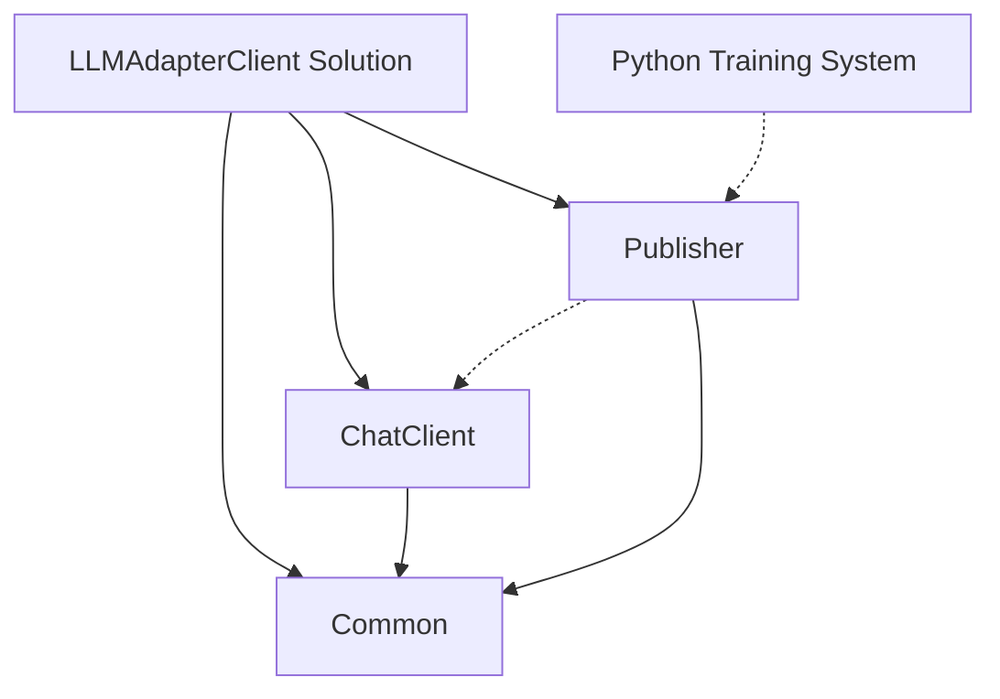
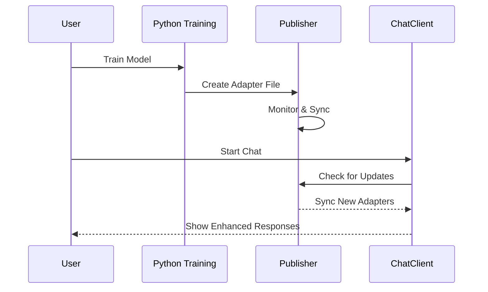

# LLM Adapter Client

A .NET solution that integrates with a Python training system to distribute and use LoRA adapters for Large Language Models.

## Project Overview

The LLM Adapter Client provides a bridge between Python-based LoRA adapter training and .NET applications. It enables automatic distribution and usage of trained adapters in a chat interface.

### Key Features

- **Automatic Adapter Detection**: Monitors for newly trained adapters from the Python system
- **Adapter Distribution**: Publishes adapters to a shared location for client applications
- **Chat Interface**: Provides an interactive console for chatting with adapter-enhanced LLMs
- **Real-time Updates**: Automatically detects and applies new adapters during chat sessions

## Project Structure

```
LLMAdapterClient/
├── LLMAdapterClient.Common/           # Core interfaces and models
│   └── Interfaces.cs                  # Contains IAdapterInfo and IAdapterPublisher
├── LLMAdapterClient.Publisher/        # Adapter publishing application
│   └── Program.cs                     # Publisher entry point
├── LLMAdapterClient.ChatClient/       # Chat interface application
│   └── Program.cs                     # ChatClient entry point
├── LLMAdapterClient.Common.Tests/     # Tests for common interfaces
│   └── InterfaceTests.cs              # Tests for IAdapterInfo and IAdapterPublisher
├── llm_training-main/                 # Python training system
│   ├── main.py                        # Training script
│   ├── config.yaml                    # Training configuration
│   └── checkpoints/                   # Generated adapter files
│       ├── best_model_adapter/        # Best performing adapter
│       └── checkpoint_epoch_*_adapter/# Checkpoint adapters
├── IMPLEMENTATION.md                  # TDD implementation plan
├── STORY.md                           # Project narrative
└── README.md                          # This file
```

## Solution Structure
The solution consists of three main projects:

- **LLMAdapterClient.Common**: Core interfaces and models shared across projects
- **LLMAdapterClient.Publisher**: Console application that monitors and distributes adapters
- **LLMAdapterClient.ChatClient**: Console application for interacting with enhanced LLMs

### Core Interfaces

The Common library defines these key interfaces:

```csharp
public interface IAdapterInfo
{
    string Name { get; }
    string FilePath { get; }
    DateTime Created { get; }
    Dictionary<string, object> Metadata { get; }
}

public interface IAdapterPublisher
{
    event EventHandler<AdapterEventArgs> AdapterPublished;
    IReadOnlyList<IAdapterInfo> GetAvailableAdapters();
    Task<IAdapterInfo> GetLatestAdapterAsync();
}
```

## Getting Started

### Prerequisites

- .NET 7.0 SDK or later
- Python 3.8+ (for the training system)
- Git

### Installation

1. Clone the repository:
   ```bash
   git clone https://github.com/yourusername/LLMAdapterClient.git
   cd LLMAdapterClient
   ```

2. Build the solution:
   ```bash
   dotnet build
   ```

3. Set up the Python training environment (optional):
   ```bash
   cd llm_training-main
   pip install -r requirements.txt
   ```

## Usage

### Training Adapters (Python)

1. Configure the training parameters in `llm_training-main/config.yaml`
2. Run the training script:
   ```bash
   python main.py --mode train --config config.yaml
   ```
3. Adapters will be generated in the `llm_training-main/checkpoints` directory

### Publishing Adapters (.NET)

1. Run the Publisher application:
   ```bash
   dotnet run --project LLMAdapterClient.Publisher
   ```
2. The Publisher will monitor the adapter directory and distribute new adapters

### Chat Interface (.NET)

1. Run the ChatClient application:
   ```bash
   dotnet run --project LLMAdapterClient.ChatClient
   ```
2. Chat with the enhanced LLM through the console interface
3. The client will automatically update when new adapters are available

## Development

### Project Architecture



### Data Flow



### Testing

Run the tests using:
```bash
dotnet test
```

Current test results:
```
Passed!  - Failed: 0, Passed: 6, Skipped: 0, Total: 6, Duration: 12 ms - LLMAdapterClient.Common.Tests.dll
```
The test suite includes:
- Unit tests for core interfaces (IAdapterInfo, IAdapterPublisher)
- Tests for event handling and adapter metadata
- Tests for publisher functionality

## Implementation Status

- ✅ Phase 1: Project Structure and Common Components
  - Created solution structure with three projects
  - Implemented core interfaces (IAdapterInfo, IAdapterPublisher)
  - Added comprehensive tests for interfaces
- 🔄 Phase 2: Publisher with File System Watcher
  - In progress: Implementing file system watcher
  - In progress: Adapter metadata extraction
  - In progress: File synchronization
- ⏳ Phase 3: Chat Client Implementation
- ⏳ Phase 4: Integration and System Tests

## Python Adapter Structure

The Python training system generates adapter files with the following structure:

```
best_model_adapter/
├── README.md                # Usage instructions
├── adapter_config.json      # Configuration parameters
├── adapter_model.safetensors # Model weights
└── metadata.pt              # Training metadata
```

## Documentation

- [Implementation Plan](IMPLEMENTATION.md): Detailed TDD implementation plan
- [Project Story](STORY.md): Narrative description of how the system works
