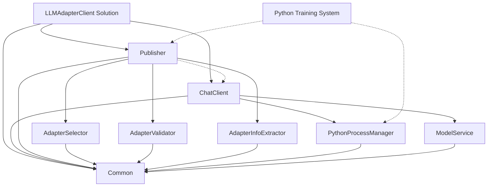
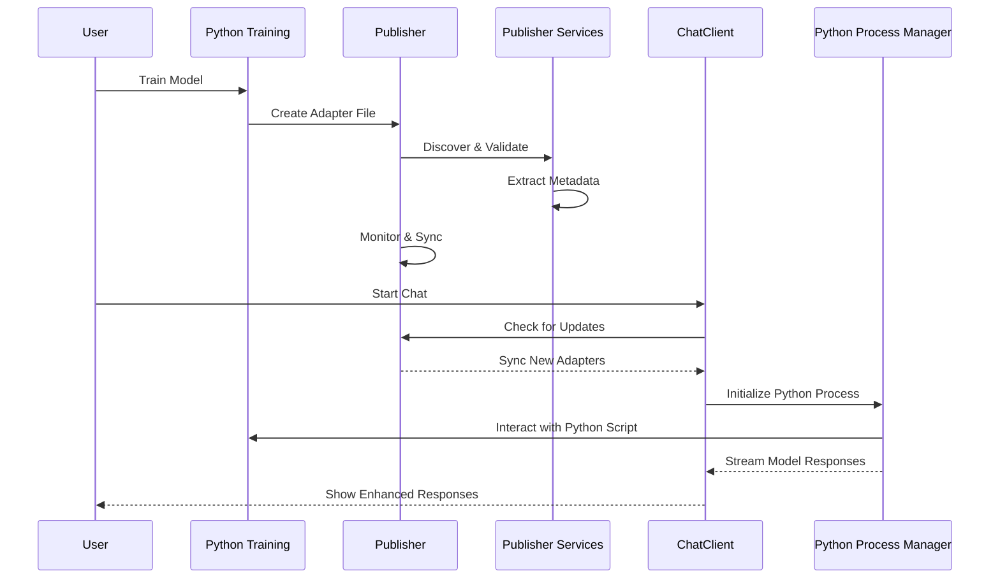

# LLM Adapter Client

A .NET solution that integrates with a Python training system to distribute and use LoRA adapters for Large Language Models.

## Project Overview

The LLM Adapter Client provides a bridge between Python-based LoRA adapter training and .NET applications. It enables automatic distribution and usage of trained adapters in a chat interface.

### Key Features

- **Automatic Adapter Detection**: Monitors for newly trained adapters from the Python system
- **Adapter Distribution**: Publishes adapters to a shared location for client applications
- **Chat Interface**: Provides an interactive console for chatting with adapter-enhanced LLMs
- **Real-time Updates**: Automatically detects and applies new adapters during chat sessions
- **Robust Python Integration**: Manages Python processes for stable communication with LLM models

## Project Structure

```
LLMAdapterClient/
├── LLMAdapterClient.Common/           # Core interfaces and models
│   └── Interfaces.cs                  # Contains IAdapterInfo, IAdapterPublisher, and IPythonProcessManager
├── LLMAdapterClient.Publisher/        # Adapter publishing application
│   ├── Program.cs                     # Publisher entry point
│   └── Services/                      # Publisher services
│       ├── AdapterSelector.cs         # Discovers adapter directories
│       ├── AdapterValidator.cs        # Validates adapter file structure
│       └── AdapterInfoExtractor.cs    # Extracts adapter metadata
├── LLMAdapterClient.ChatClient/       # Chat interface application
│   ├── Program.cs                     # ChatClient entry point
│   └── Services/                      # ChatClient services
│       └── PythonProcessManager.cs    # Manages Python process communication
├── LLMAdapterClient.Common.Tests/     # Tests for common interfaces
│   └── InterfaceTests.cs              # Tests for IAdapterInfo and IAdapterPublisher
├── LLMAdapterClient.Publisher.Tests/  # Tests for publisher services
│   └── AdapterTests.cs                # Tests for adapter services
├── LLMAdapterClient.ChatClient.Tests/ # Tests for ChatClient services
│   └── PythonProcessManagerTests.cs   # Tests for Python process management
├── llm_training-main/                 # Python training system
│   ├── main.py                        # Training script
│   ├── config.yaml                    # Training configuration
│   └── checkpoints/                   # Generated adapter files
│       ├── best_model_adapter/        # Best performing adapter
│       └── checkpoint_epoch_*_adapter/# Checkpoint adapters
├── IMPLEMENTATION.md                  # TDD implementation plan
├── STORY.md                          # Project narrative
├── global.json                        # .NET SDK version configuration
└── README.md                          # This file
```

## Solution Structure
The solution consists of three main projects:

- **LLMAdapterClient.Common**: Core interfaces and models shared across projects
- **LLMAdapterClient.Publisher**: Console application that monitors and distributes adapters
  - **Services**: Core adapter management services
    - `AdapterSelector`: Discovers and selects valid adapter directories
    - `AdapterValidator`: Validates adapter file structure and integrity
    - `AdapterInfoExtractor`: Extracts metadata from adapter configuration files
- **LLMAdapterClient.ChatClient**: Console application for interacting with enhanced LLMs
  - **Services**: Core chat and model integration services
    - `PythonProcessManager`: Manages Python process lifecycle for LLM communication
      - Starts Python processes with appropriate arguments
      - Handles command sending and response parsing
      - Provides streaming token-by-token response capabilities
      - Ensures graceful process termination

### Core Interfaces

The Common library defines these key interfaces:

```csharp
public interface IAdapterInfo
{
    string Name { get; }
    string FilePath { get; }
    DateTime Created { get; }
    Dictionary<string, object> Metadata { get; }
}

public interface IAdapterPublisher
{
    event EventHandler<AdapterEventArgs> AdapterPublished;
    IReadOnlyList<IAdapterInfo> GetAvailableAdapters();
    Task<IAdapterInfo> GetLatestAdapterAsync();
}

public interface IPythonProcessManager
{
    event EventHandler<string> OutputReceived;
    event EventHandler<string> ErrorReceived;
    Task StartAsync(string pythonPath, string scriptPath, string[] args);
    Task<string> SendCommandAsync(string command, CancellationToken token = default);
    IAsyncEnumerable<string> SendCommandStreamingAsync(string command, CancellationToken token = default);
    Task StopAsync();
    bool IsRunning { get; }
}
```

### Publisher Services

The Publisher project implements these key services:

```csharp
public class AdapterSelector
{
    public IEnumerable<string> GetAvailableAdapterDirectories();
}

public class AdapterValidator
{
    public bool ValidateAdapter(string adapterPath);
}

public class AdapterInfoExtractor
{
    public Task<IAdapterInfo> ExtractAdapterInfoAsync(string adapterPath);
}
```

### Chat Client Services

The ChatClient project implements these key services:

```csharp
public class PythonProcessManager : IPythonProcessManager, IDisposable
{
    public event EventHandler<string> OutputReceived;
    public event EventHandler<string> ErrorReceived;
    public bool IsRunning { get; }
    
    public Task StartAsync(string pythonPath, string scriptPath, string[] args);
    public Task<string> SendCommandAsync(string command, CancellationToken token = default);
    public IAsyncEnumerable<string> SendCommandStreamingAsync(string command, CancellationToken token = default);
    public Task StopAsync();
    public void Dispose();
}
```

## Getting Started

### Prerequisites

- .NET 9.0 SDK or later
- Python 3.8+ (for the training system)
- Git

### Installation

1. Clone the repository:
   ```bash
   git clone https://github.com/yourusername/LLMAdapterClient.git
   cd LLMAdapterClient
   ```

2. Build the solution:
   ```bash
   dotnet build
   ```

3. Set up the Python training environment (optional):
   ```bash
   cd llm_training-main
   pip install -r requirements.txt
   ```

## Usage

### Training Adapters (Python)

1. Configure the training parameters in `llm_training-main/config.yaml`
2. Run the training script:
   ```bash
   python main.py --mode train --config config.yaml
   ```
3. Adapters will be generated in the `llm_training-main/checkpoints` directory

### Publishing Adapters (.NET)

1. Run the Publisher application:
   ```bash
   dotnet run --project LLMAdapterClient.Publisher
   ```
2. The Publisher will monitor the adapter directory and distribute new adapters

### Chat Interface (.NET)

1. Run the ChatClient application:
   ```bash
   dotnet run --project LLMAdapterClient.ChatClient
   ```
2. Chat with the enhanced LLM through the console interface
3. The client will automatically update when new adapters are available

## Development

### Project Architecture



### Data Flow



### Testing

The project includes comprehensive test suites and procedures for verifying functionality.

#### Running Tests

1. **Unit Tests**
```bash
# Run all tests with detailed output
dotnet test --logger "console;verbosity=detailed"

# Run specific test project
dotnet test LLMAdapterClient.Publisher.Tests --logger "console;verbosity=detailed"

# Run specific test class
dotnet test --filter "FullyQualifiedName~LLMAdapterClient.Publisher.Tests.AdapterTests"

# Run specific test method
dotnet test --filter "FullyQualifiedName=LLMAdapterClient.Publisher.Tests.AdapterTests.AdapterSelector_ShouldFindValidAdapterDirectories"
```

2. **Test Coverage**
```bash
# Generate test coverage report
dotnet test /p:CollectCoverage=true /p:CoverletOutputFormat=lcov /p:CoverletOutput=./lcov.info
```

3. **Integration Testing**

Build and run the Publisher in debug mode:
```bash
dotnet build LLMAdapterClient.Publisher -c Debug
dotnet run --project LLMAdapterClient.Publisher -c Debug -- --verbose
```

Verify the output shows:
- Successful adapter discovery
- Proper file validation
- Metadata extraction
- Successful publishing to shared storage

4. **Manual Testing**

a. Test Adapter Discovery:
```bash
cd LLMAdapterClient.Publisher
dotnet run
```

Expected output:
```
Available adapters:
- best_model_adapter
- checkpoint_epoch_2_adapter
- checkpoint_epoch_4_adapter
```

b. Test Adapter Validation:
```bash
# Create invalid adapter
mkdir -p llm_training-main/checkpoints/invalid_adapter
touch llm_training-main/checkpoints/invalid_adapter/adapter_config.json

# Run publisher to verify validation
dotnet run --project LLMAdapterClient.Publisher
```

c. Test Metadata Extraction:
```bash
# Examine adapter config
cat llm_training-main/checkpoints/best_model_adapter/adapter_config.json

# Run publisher to verify metadata
dotnet run --project LLMAdapterClient.Publisher
```

d. Test Python Process Management:
```bash
# Create a simple test Python script
echo 'print("Hello from Python")' > test_script.py

# Run the test script through PythonProcessManager
dotnet run --project LLMAdapterClient.ChatClient.Tests -- --filter "PythonProcessManagerTests"
```

5. **Debugging**

Run with debugger:
```bash
dotnet run --project LLMAdapterClient.Publisher --launch-profile "Publisher.Debug"
```

Key breakpoint locations:
- AdapterSelector.GetAvailableAdapterDirectories()
- AdapterValidator.ValidateAdapter()
- AdapterInfoExtractor.ExtractAdapterInfoAsync()
- AdapterUploader.UploadAdapterAsync()
- PythonProcessManager.StartAsync()
- PythonProcessManager.SendCommandAsync()
- PythonProcessManager.SendCommandStreamingAsync()

6. **Error Handling Tests**

Test missing checkpoints:
```bash
mv llm_training-main/checkpoints llm_training-main/checkpoints_backup
dotnet run --project LLMAdapterClient.Publisher
mv llm_training-main/checkpoints_backup llm_training-main/checkpoints
```

Test invalid files:
```bash
# Backup and corrupt config
cp llm_training-main/checkpoints/best_model_adapter/adapter_config.json{,.bak}
echo "invalid json" > llm_training-main/checkpoints/best_model_adapter/adapter_config.json

# Test and restore
dotnet run --project LLMAdapterClient.Publisher
mv llm_training-main/checkpoints/best_model_adapter/adapter_config.json{.bak,}
```

Test Python process errors:
```bash
# Create an invalid Python script
echo 'import sys; sys.exit(1)' > invalid_script.py

# Test PythonProcessManager error handling
dotnet run --project LLMAdapterClient.ChatClient.Tests -- --filter "PythonProcessManagerTests_ShouldHandleErrors"
```

7. **Cleanup**
```bash
# Remove test artifacts
rm -rf ~/.local/share/LLMAdapterClient/shared_storage/*
rm -rf llm_training-main/checkpoints/invalid_adapter
rm -f test_script.py invalid_script.py
```

Current test results:
```
Passed!  - Failed: 0, Passed: 6, Skipped: 0, Total: 6, Duration: 12 ms - LLMAdapterClient.Common.Tests.dll
Passed!  - Failed: 0, Passed: 5, Skipped: 0, Total: 5, Duration: 24 ms - LLMAdapterClient.Publisher.Tests.dll
Passed!  - Failed: 0, Passed: 5, Skipped: 0, Total: 5, Duration: 756 ms - LLMAdapterClient.ChatClient.Tests.dll
```

The test suite includes:
- Unit tests for core interfaces (IAdapterInfo, IAdapterPublisher, IPythonProcessManager)
- Tests for event handling and adapter metadata
- Tests for adapter selection and validation
- Tests for metadata extraction
- Tests for publisher functionality
- Tests for Python process management and communication

## Implementation Status

- ✅ Phase 1: Project Structure and Common Components
  - Created solution structure with three projects
  - Implemented core interfaces (IAdapterInfo, IAdapterPublisher)
  - Added comprehensive tests for interfaces
- ✅ Phase 2: Publisher Implementation
  - ✅ Implemented adapter selection service
  - ✅ Implemented adapter validation service
  - ✅ Implemented metadata extraction service
  - ✅ Implemented adapter upload system
  - ✅ Implemented publisher service with event handling
- 🔄 Phase 3: Chat Client Implementation
  - ✅ Implemented Python process management
  - ✅ Created tests for Python process interaction
  - 🔄 Implementing model service
  - ⏳ Implementing adapter loading
  - ⏳ Implementing chat UI
  - ⏳ Implementing chat session management
- ⏳ Phase 4: Integration and System Tests

## Python Adapter Structure

The Python training system generates adapter files with the following structure:

```
best_model_adapter/
├── README.md                # Usage instructions
├── adapter_config.json      # Configuration parameters
├── adapter_model.safetensors # Model weights
└── metadata.pt              # Training metadata
```

## Documentation

- [Implementation Plan](IMPLEMENTATION.md): Detailed TDD implementation plan
- [Project Story](STORY.md): Narrative description of how the system works
