# LLM Adapter Client

A .NET solution that integrates with a Python training system to distribute and use LoRA adapters for Large Language Models.

## Project Overview

The LLM Adapter Client provides a bridge between Python-based LoRA adapter training and .NET applications. It enables automatic distribution and usage of trained adapters in a chat interface.

### Key Features

- **Automatic Adapter Detection**: Monitors for newly trained adapters from the Python system
- **Adapter Distribution**: Publishes adapters to a shared location for client applications
- **Chat Interface**: Provides an interactive console for chatting with adapter-enhanced LLMs
- **Real-time Updates**: Automatically detects and applies new adapters during chat sessions
- **Robust Python Integration**: Manages Python processes for stable communication with LLM models
- **Streaming Responses**: Provides token-by-token streaming for responsive chat experience
- **Command System**: Supports special commands for chat management and RAG capabilities
- **Event-Based Architecture**: Uses events for adapter announcements and model messages

## Project Structure

```
LLMAdapterClient/
├── LLMAdapterClient.Common/           # Core interfaces and models
│   └── Interfaces.cs                  # Contains IAdapterInfo, IAdapterPublisher, and IPythonProcessManager
├── LLMAdapterClient.Publisher/        # Adapter publishing application
│   ├── Program.cs                     # Publisher entry point
│   └── Services/                      # Publisher services
│       ├── AdapterSelector.cs         # Discovers adapter directories
│       ├── AdapterValidator.cs        # Validates adapter file structure
│       └── AdapterInfoExtractor.cs    # Extracts adapter metadata
├── LLMAdapterClient.ChatClient/       # Chat interface application
│   ├── Program.cs                     # ChatClient entry point
│   └── Services/                      # ChatClient services
│       ├── PythonProcessManager.cs    # Manages Python process communication
│       ├── ModelService.cs            # Interfaces with the LLM model
│       ├── AdapterManager.cs          # Manages adapter loading and monitoring
│       ├── ConsoleChatUI.cs           # Provides console UI for chat interactions
│       └── ChatSession.cs             # Manages conversation flow and commands
├── LLMAdapterClient.Common.Tests/     # Tests for common interfaces
│   └── InterfaceTests.cs              # Tests for IAdapterInfo and IAdapterPublisher
├── LLMAdapterClient.Publisher.Tests/  # Tests for publisher services
│   └── AdapterTests.cs                # Tests for adapter services
├── LLMAdapterClient.ChatClient.Tests/ # Tests for ChatClient services
│   ├── PythonProcessManagerTests.cs   # Tests for Python process management
│   ├── ModelServiceTests.cs           # Tests for model service functionality
│   ├── AdapterManagerTests.cs         # Tests for adapter manager
│   ├── ChatUITests.cs                 # Tests for chat UI components
│   └── ChatSessionTests.cs            # Tests for chat session management
├── llm_training-main/                 # Python training system
│   ├── main.py                        # Training script
│   ├── config.yaml                    # Training configuration
│   └── checkpoints/                   # Generated adapter files
│       ├── best_model_adapter/        # Best performing adapter
│       └── checkpoint_epoch_*_adapter/# Checkpoint adapters
├── IMPLEMENTATION.md                  # TDD implementation plan
├── STORY.md                          # Project narrative
├── global.json                        # .NET SDK version configuration
└── README.md                          # This file
```

## Solution Structure
The solution consists of three main projects:

- **LLMAdapterClient.Common**: Core interfaces and models shared across projects
- **LLMAdapterClient.Publisher**: Console application that monitors and distributes adapters
  - **Services**: Core adapter management services
    - `AdapterSelector`: Discovers and selects valid adapter directories
    - `AdapterValidator`: Validates adapter file structure and integrity
    - `AdapterInfoExtractor`: Extracts metadata from adapter configuration files
- **LLMAdapterClient.ChatClient**: Console application for interacting with enhanced LLMs
  - **Services**: Core chat and model integration services
    - `PythonProcessManager`: Manages Python process lifecycle for LLM communication
      - Starts Python processes with appropriate arguments
      - Handles command sending and response parsing
      - Provides streaming token-by-token response capabilities
      - Ensures graceful process termination
    - `PythonModelService`: Manages model service with adapter support
      - Initializes model with appropriate adapter
      - Provides complete and streaming response generation
      - Handles special commands
      - Manages resources properly
    - `AdapterManager`: Manages adapter loading and monitoring
      - Loads adapters from shared storage
      - Monitors for new adapters with proper event notifications
      - Initializes model service with adapters
    - `ConsoleChatUI`: Provides user interface for chat interactions
      - Displays messages with role-based coloring
      - Streams token-by-token responses
      - Handles user input with proper prompting
      - Displays system messages and errors
    - `ChatSession`: Manages the conversation flow
      - Coordinates between model, adapter manager, and UI
      - Handles user messages and special commands
      - Provides timeout protection for model responses
      - Ensures proper resource cleanup

### Core Interfaces


### Publisher Services


### Chat Client Services


## Getting Started

### Prerequisites

- .NET 9.0 SDK or later
- Python 3.8+ (for the training system)
- Git

### Installation

1. Clone the repository:
   ```bash
   git clone https://github.com/yourusername/LLMAdapterClient.git
   cd LLMAdapterClient
   ```

2. Build the solution:
   ```bash
   dotnet build
   ```

3. Set up the Python training environment (optional):
   ```bash
   cd llm_training-main
   pip install -r requirements.txt
   ```

## Usage

### Training Adapters (Python)

1. Configure the training parameters in `llm_training-main/config.yaml`
2. Run the training script:
   ```bash
   python main.py --mode train --config config.yaml
   ```
3. Adapters will be generated in the `llm_training-main/checkpoints` directory

### Publishing Adapters (.NET)

1. Run the Publisher application:
   ```bash
   dotnet run --project LLMAdapterClient.Publisher
   ```
2. The Publisher will monitor the adapter directory and distribute new adapters

### Chat Interface (.NET)

1. Run the ChatClient application:
   ```bash
   dotnet run --project LLMAdapterClient.ChatClient
   ```
2. Chat with the enhanced LLM through the console interface
3. The client will automatically update when new adapters are available
4. Use special commands to control the chat session:
   - `/help` - Display help message
   - `/clear` - Clear the chat history
   - `/exit` or `/quit` - Exit the chat session
   - `/loadrag <path>` - Load RAG from specified path
   - `/ragstatus` - Show RAG system status

## Development

### Project Architecture


### Data Flow

```mermaid
sequenceDiagram
    %% Participants with emoji and color indicators
    participant User as "👤 User"
    participant Training as "🐍 Python Training"
    participant Publisher as "📤 Publisher"
    participant Services as "🛠️ Publisher Services"
    participant ChatClient as "💬 ChatClient"
    participant ChatSession as "🔄 ChatSession"
    participant ChatUI as "🖥️ ConsoleChatUI"
    participant AdapterManager as "📂 AdapterManager"
    participant ModelService as "🧠 ModelService"
    participant PythonMgr as "⚙️ Python Process Manager"
    
    %% Section headers with color notes
    Note over Training: Python Training System
    
    %% Adapter Training Flow
    autonumber 1
    User->>+Training: Train Model
    Training-->>-Publisher: Create Adapter File
    
    Note over Publisher: Publisher Application
    
    %% Publisher Processing Flow
    autonumber 3
    Publisher->>+Services: Discover & Validate Adapters
    Services->>Services: Extract Metadata
    Services-->>-Publisher: Return Adapter Information
    Publisher->>Publisher: Monitor & Sync Adapters
    
    Note over ChatClient: Chat Client Application
    
    %% Chat Initialization Flow
    autonumber 7
    User->>+ChatClient: Start Chat Application
    ChatClient->>+Publisher: Request Latest Adapters
    Publisher-->>-ChatClient: Sync Available Adapters
    ChatClient->>+ChatSession: Initialize Chat Session
    ChatSession->>+AdapterManager: Get Latest Adapter
    AdapterManager-->>-ChatSession: Return Best Adapter
    ChatSession->>+ModelService: Initialize Model with Adapter
    ModelService->>+PythonMgr: Start Python Process
    PythonMgr->>Training: Load Model & Adapter
    PythonMgr-->>-ModelService: Report Initialization Complete
    ModelService-->>-ChatSession: Report Model Ready
    ChatSession-->>-ChatClient: Session Initialization Complete
    ChatClient-->>-User: Display Welcome Message
    
    %% Chat Interaction Flow
    autonumber 20
    User->>+ChatUI: Enter Message or Command
    ChatUI->>+ChatSession: Forward User Input
    ChatSession->>+ModelService: Generate Response
    ModelService->>+PythonMgr: Send Prompt to Python
    PythonMgr-->>PythonMgr: Process Input & Generate Tokens
    PythonMgr-->>-ModelService: Stream Response Tokens
    ModelService-->>-ChatSession: Forward Processed Tokens
    ChatSession-->>-ChatUI: Display Streaming Response
    ChatUI-->>-User: Show Formatted Response
    
    %% New Adapter Notification Flow
    autonumber 29
    Publisher-->>+AdapterManager: Announce New Adapter Available
    AdapterManager-->>+ChatSession: Notify New Adapter Detected
    ChatSession-->>+ChatUI: Announce Adapter Update
    ChatUI-->>-User: Display Update Notification
    ChatSession->>+ModelService: Update Model with New Adapter
    ModelService-->>-ChatSession: Confirm Adapter Updated
    
    %% Legend
    Note over User, PythonMgr: Sequence Legend:
    Note over User, PythonMgr: → Solid arrows: Direct method calls/actions
    Note over User, PythonMgr: → Dashed arrows: Responses/events/callbacks
    Note over User, PythonMgr: | Activation bars: Component active duration
```



### Testing

The project includes comprehensive test suites and procedures for verifying functionality.

#### Running Tests

1. **Unit Tests**
```bash
# Run all tests with detailed output
dotnet test --logger "console;verbosity=detailed"

# Run specific test project
dotnet test LLMAdapterClient.Publisher.Tests --logger "console;verbosity=detailed"

# Run specific test class
dotnet test --filter "FullyQualifiedName~LLMAdapterClient.Publisher.Tests.AdapterTests"

# Run specific test method
dotnet test --filter "FullyQualifiedName=LLMAdapterClient.Publisher.Tests.AdapterTests.AdapterSelector_ShouldFindValidAdapterDirectories"
```

2. **Test Coverage**
```bash
# Generate test coverage report
dotnet test /p:CollectCoverage=true /p:CoverletOutputFormat=lcov /p:CoverletOutput=./lcov.info
```

3. **Integration Testing**

Build and run the Publisher in debug mode:
```bash
dotnet build LLMAdapterClient.Publisher -c Debug
dotnet run --project LLMAdapterClient.Publisher -c Debug -- --verbose
```

Verify the output shows:
- Successful adapter discovery
- Proper file validation
- Metadata extraction
- Successful publishing to shared storage

4. **Manual Testing**

a. Test Adapter Discovery:
```bash
cd LLMAdapterClient.Publisher
dotnet run
```

Expected output:
```
Available adapters:
- best_model_adapter
- checkpoint_epoch_2_adapter
- checkpoint_epoch_4_adapter
```

b. Test Chat Client:
```bash
cd LLMAdapterClient.ChatClient
dotnet run
```

Expected output:
```
LLM Adapter Chat Client
======================
[System] Loading the latest adapter...
[System] Initializing model with adapter 'best_model_adapter'...
[System] Welcome to the LLM Chat! Type /help for available commands.
>
```

c. Test Chat Commands:
```
> /help
[System] Available commands:
[System]   /help   - Display this help message
[System]   /exit   - Exit the chat session
[System]   /quit   - Exit the chat session
[System]   /clear  - Clear the console and chat history
```

d. Test Chat Interaction:
```
> Hello, how are you today?
[System] Thinking...
[Assistant] I'm doing well, thank you for asking! As an AI assistant, I don't have feelings in the human sense, but I'm functioning properly and ready to help you with any questions or tasks you might have. How can I assist you today?

>
```

5. **Debugging**

Run with debugger:
```bash
dotnet run --project LLMAdapterClient.Publisher --launch-profile "Publisher.Debug"
```

Key breakpoint locations:
- AdapterSelector.GetAvailableAdapterDirectories()
- AdapterValidator.ValidateAdapter()
- AdapterInfoExtractor.ExtractAdapterInfoAsync()
- AdapterUploader.UploadAdapterAsync()
- PythonProcessManager.StartAsync()
- PythonProcessManager.SendCommandAsync()
- PythonProcessManager.SendCommandStreamingAsync()
- ModelService.InitializeAsync()
- ModelService.GenerateResponseAsync()
- ModelService.GenerateStreamingResponseAsync()
- ModelService.ExecuteSpecialCommandAsync()
- ConsoleChatUI.DisplayMessage()
- ConsoleChatUI.DisplayStreamingMessageAsync()
- ChatSession.StartAsync()
- ChatSession.HandleUserMessageAsync()
- ChatSession.HandleSpecialCommandAsync()

6. **Error Handling Tests**

Test Python process errors:
```bash
# Create an invalid Python script
echo 'import sys; sys.exit(1)' > invalid_script.py

# Test PythonProcessManager error handling
dotnet run --project LLMAdapterClient.ChatClient.Tests -- --filter "PythonProcessManagerTests_ShouldHandleErrors"
```

Test timeout protection:
```bash
# Using the chat client
> /timeout_test

# The chat session should recover after timeout (2 minutes)
[System] Response generation timed out.
```

7. **Cleanup**
```bash
# Remove test artifacts
rm -rf ~/.local/share/LLMAdapterClient/shared_storage/*
rm -rf llm_training-main/checkpoints/invalid_adapter
rm -f test_script.py invalid_script.py
```

Current test results:
```
Passed!  - Failed: 0, Passed: 6, Skipped: 0, Total: 6, Duration: 12 ms - LLMAdapterClient.Common.Tests.dll
Passed!  - Failed: 0, Passed: 5, Skipped: 0, Total: 5, Duration: 24 ms - LLMAdapterClient.Publisher.Tests.dll
Passed!  - Failed: 0, Passed: 28, Skipped: 0, Total: 28, Duration: 1.2s - LLMAdapterClient.ChatClient.Tests.dll
```

The test suite includes:
- Unit tests for core interfaces (IAdapterInfo, IAdapterPublisher, IPythonProcessManager, etc.)
- Tests for event handling and adapter metadata
- Tests for adapter selection and validation
- Tests for metadata extraction
- Tests for publisher functionality
- Tests for Python process management and communication
- Tests for model service initialization and response generation
- Tests for adapter manager loading and monitoring
- Tests for chat UI rendering and user input
- Tests for chat session management and command processing

## Implementation Status


**Legend:** ✅ Done &nbsp;|&nbsp; 🔶 In Progress &nbsp;|&nbsp; ⬜ Planned

## Phase 5: IPFS Integration

Phase 5 focuses on implementing the InterPlanetary File System (IPFS) for decentralized adapter distribution. IPFS will enable resilient, content-addressed storage and retrieval of adapters across distributed networks.

### Core IPFS Principles

Our implementation adheres to IPFS core principles:

1. **Content Addressing**: Adapters are addressed by their content (CID) rather than location
2. **Transport Agnosticism**: Storage and retrieval work over any transport protocol
3. **Verification**: All content is cryptographically verified against its CID
4. **Offline Support**: Adapters remain available even without internet connectivity

### IPFS Architecture


### Implementation Tasks

#### 1. IPFS Content Addressing System

- **Implement CID Generation**: Support both CIDv0 and CIDv1 with appropriate multihash
- **Create Verification Pipeline**: Verify all adapter content against CIDs
- **Support Incremental Verification**: Handle large adapters efficiently
- **Implement Content Integrity Checking**: Guarantee adapter data hasn't been modified

```csharp
// Sample CID generation and verification
public class ContentAddressingSystem : IContentAddressingSystem
{
    public async Task<string> GenerateCidAsync(string filePath, CancellationToken token = default)
    {
        // Calculate multihash from file content
        // Format as CIDv1 with appropriate codec information
        // Return formatted CID
    }
    
    public async Task<bool> VerifyContentAsync(string filePath, string cid, CancellationToken token = default)
    {
        // Generate CID from current content
        // Compare with the provided CID
        // Return verification result
    }
}
```

#### 2. Transport-Agnostic Layer

- **Create Abstracted API Interface**: Support multiple IPFS implementations
- **Implement HTTP API Client**: For interaction with Kubo nodes
- **Add Direct libp2p Support**: For peer-to-peer communication
- **Support Multiple Transports**: HTTP, WebSockets, TCP/IP

```csharp
// Transport-agnostic interface
public interface IIpfsTransport
{
    Task<byte[]> GetAsync(string cid, CancellationToken token = default);
    Task<string> AddAsync(byte[] data, CancellationToken token = default);
    Task<bool> PinAsync(string cid, CancellationToken token = default);
    // Additional transport operations
}

// Implementation for HTTP API
public class IpfsHttpTransport : IIpfsTransport
{
    private readonly HttpClient _client;
    private readonly string _apiEndpoint;
    
    // Implementation of transport-agnostic operations via HTTP
}

// Implementation for direct libp2p
public class IpfsLibp2pTransport : IIpfsTransport
{
    // Implementation via direct libp2p protocol
}
```

#### 3. DHT & PubSub Integration

- **Implement DHT-Based Peer Discovery**: Find peers with desired adapters
- **Create PubSub Announcement System**: Real-time adapter notifications
- **Build Bootstrapping Mechanism**: Connect to network efficiently
- **Implement Routing Table Management**: Optimize peer connections

```csharp
// DHT-based peer discovery
public class DhtPeerDiscovery : IPeerDiscovery
{
    public async Task<IEnumerable<PeerInfo>> FindProvidersAsync(string cid, int limit = 20)
    {
        // Use DHT to find providers of the specified CID
        // Return list of peers that can provide the content
    }
}

// PubSub for adapter announcements
public class AdapterAnnouncementSystem : IAdapterAnnouncementSystem
{
    public event EventHandler<AdapterAnnouncedEventArgs> AdapterAnnounced;
    
    public async Task AnnounceAdapterAsync(IAdapterInfo adapter)
    {
        // Publish adapter information to PubSub topic
    }
    
    public async Task SubscribeToAnnouncementsAsync()
    {
        // Subscribe to adapter announcement topic
        // Raise events when new adapters are announced
    }
}
```

#### 4. Adapter Registry

- **Build Distributed Adapter Catalog**: Track available adapters
- **Implement Metadata Indexing**: Enable adapter search and filtering
- **Create Version Management**: Track adapter revisions
- **Support Adapter Discovery**: Find adapters by capabilities

```csharp
// Adapter registry
public class IpfsAdapterRegistry : IAdapterRegistry
{
    public async Task<bool> RegisterAdapterAsync(IAdapterInfo adapter)
    {
        // Store adapter metadata in the registry
        // Index by model, capabilities, etc.
        // Return success status
    }
    
    public async Task<IEnumerable<IAdapterInfo>> QueryAdaptersAsync(
        string modelId = null, 
        Dictionary<string, object> capabilities = null)
    {
        // Search registry for adapters matching criteria
        // Return matching adapter information
    }
}
```

#### 5. Offline Support System

- **Implement Local Adapter Cache**: Keep adapters available offline
- **Create Sync Mechanism**: Update when connectivity returns
- **Build Prefetching Logic**: Download related adapters proactively
- **Implement Cache Management**: Handle limited storage scenarios

```csharp
// Offline support system
public class OfflineSupport : IOfflineSupport
{
    public async Task<IAdapterInfo> GetOfflineAdapterAsync(string adapterIdentifier)
    {
        // Check local cache for adapter
        // Return adapter if available
        // Otherwise return null or throw
    }
    
    public async Task CacheAdapterAsync(IAdapterInfo adapter)
    {
        // Store adapter in local cache
        // Index for offline retrieval
    }
    
    public async Task SyncCacheAsync(CancellationToken token = default)
    {
        // Sync local cache with network when online
        // Update metadata and download new versions
    }
}
```

#### 6. Security Features

- **Implement Access Control**: Manage adapter publishing permissions
- **Add Content Encryption**: Protect sensitive adapter data
- **Create Signature Verification**: Validate adapter authenticity
- **Support Private Networks**: Enable organizational adapter sharing

```csharp
// Security system
public class IpfsSecurity : IIpfsSecurity
{
    public async Task<string> EncryptAdapterAsync(string adapterPath, byte[] encryptionKey)
    {
        // Encrypt adapter files
        // Return path to encrypted content
    }
    
    public async Task<string> DecryptAdapterAsync(string encryptedPath, byte[] encryptionKey)
    {
        // Decrypt adapter files
        // Return path to decrypted content
    }
    
    public async Task<bool> VerifySignatureAsync(string adapterPath, byte[] publicKey)
    {
        // Verify adapter signature
        // Return verification result
    }
}
```

#### 7. IPFS Integration Testing

- **Create Mock IPFS Node**: For testing without network
- **Implement Test Fixtures**: Standard test scenarios
- **Build Performance Benchmarks**: Measure operation times
- **Create Fault Injection**: Test resilience to network issues

```csharp
// IPFS integration tests
public class IpfsIntegrationTests
{
    [Fact]
    public async Task ShouldRetrieveAdapterByContentId()
    {
        // Arrange: Set up test adapter and CID
        // Act: Retrieve adapter using CID
        // Assert: Verify adapter was retrieved correctly
    }
    
    [Fact]
    public async Task ShouldWorkInOfflineMode()
    {
        // Arrange: Set up cached adapter
        // Act: Disconnect network and retrieve adapter
        // Assert: Verify adapter is available offline
    }
    
    // Additional integration tests
}
```

### Migration Strategy

The transition from local storage to IPFS will follow this phased approach:

1. **Parallel Implementation**: Build IPFS alongside existing storage
2. **Dual Publishing Mode**: Store adapters both locally and on IPFS
3. **Client-Side Support**: Add IPFS support to ChatClient
4. **Gradual Transition**: Shift from local to IPFS storage
5. **Backward Compatibility**: Maintain support for legacy storage

### IPFS Implementation Benefits

- **Resilience**: No single point of failure
- **Decentralization**: Adapters available from multiple sources
- **Global Distribution**: Worldwide adapter availability
- **Version Control**: Natural handling of adapter versions
- **Offline Access**: Adapters available without internet
- **Peer-to-Peer Sharing**: Direct adapter sharing between clients

## Python Adapter Structure

The Python training system generates adapter files with the following structure:


## Documentation

- [Implementation Plan](IMPLEMENTATION.md): Detailed TDD implementation plan
- [Project Story](STORY.md): Narrative description of how the system works
