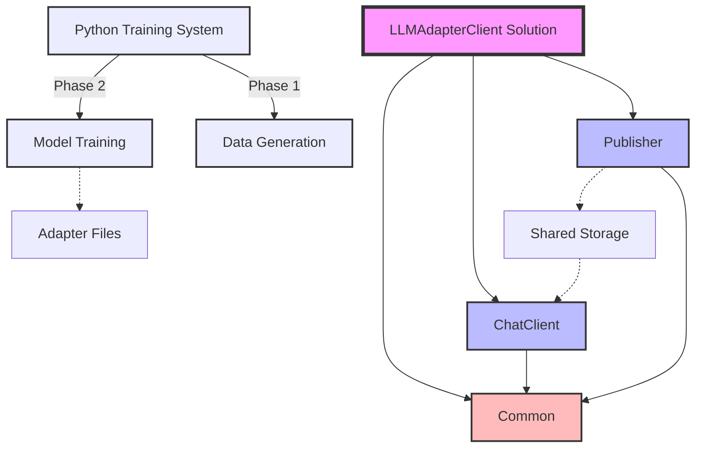
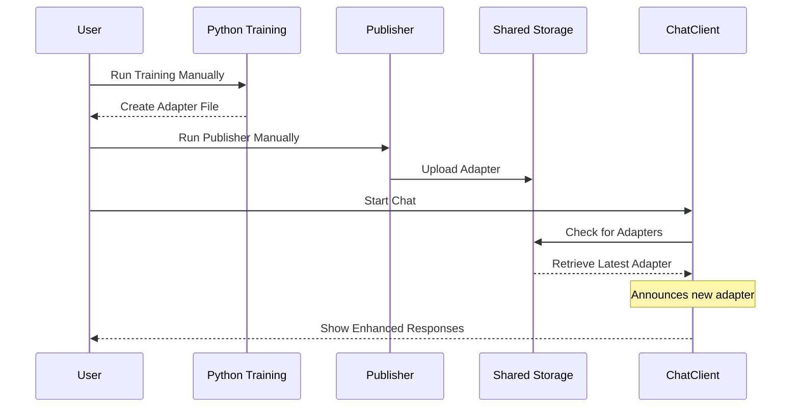
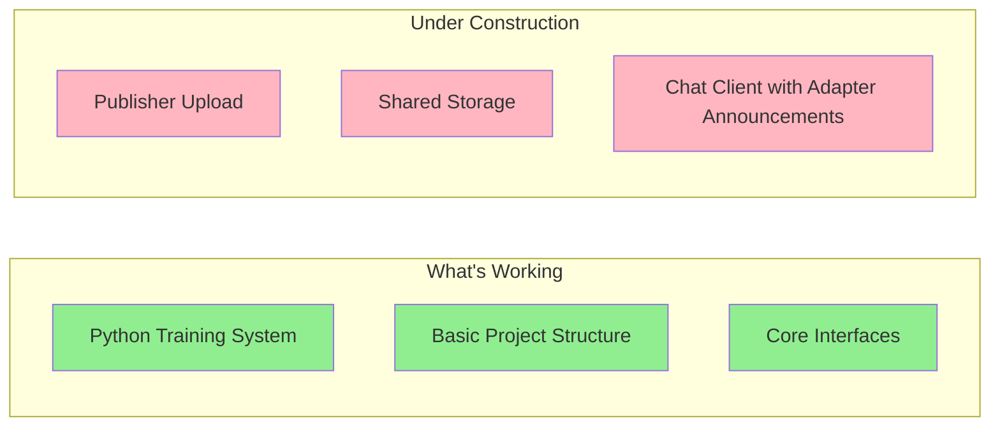
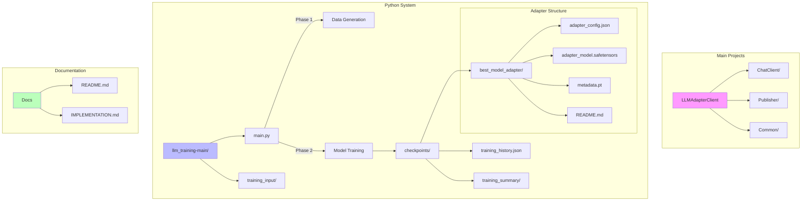
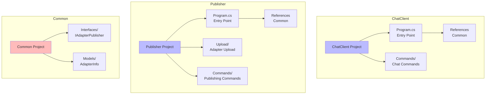
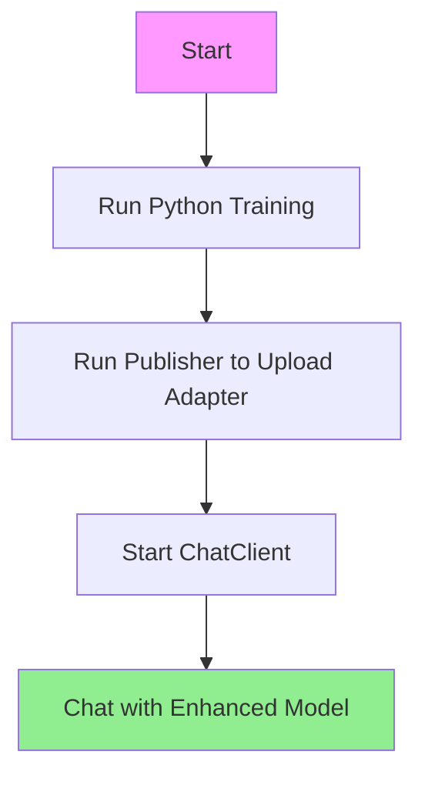
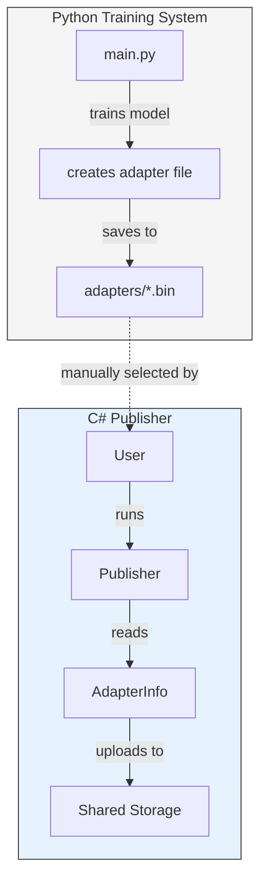
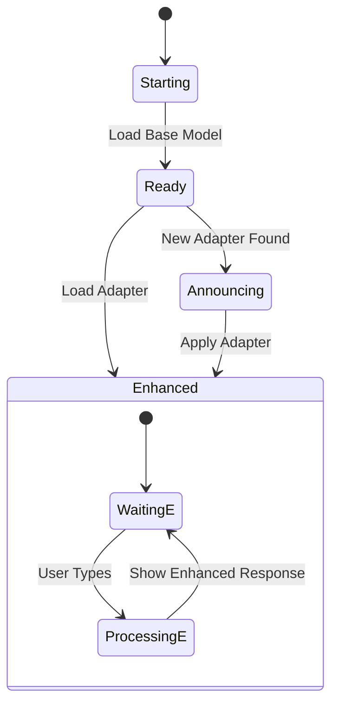
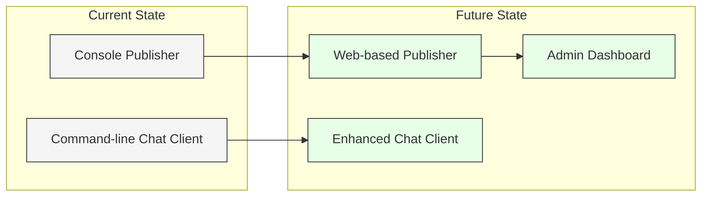

## Introduction
Hey there! 👋 If you're new to .NET and wondering how this program works, you're in the right place. Let me tell you a story about our C# implementation that works with Python-generated LoRA adapters for large language models.

## The Big Picture
First, let's look at how our C# application is organized:



- Think of this like a LEGO set where:
  - The solution (LLMAdapterClient) is your LEGO box
  - Each project (ChatClient, Publisher) is a separate LEGO model
  - Common is like the basic LEGO pieces everyone needs
  - The Python Training System operates in two phases:
    1. Data Generation: Uses GPT-3.5-turbo to create training examples
    2. Model Training: Uses deepseek-ai/deepseek-r1-distill-qwen-1.5b with LoRA
  - The Publisher manually uploads adapters to shared storage
  - The ChatClient retrieves adapters from shared storage

## How Data Flows
When you run the program, here's what happens:



- This sequence diagram shows the current workflow:
    1. **Training Flow** (separate from our C# system):
        - User runs Python training (main.py)
        - Training system creates adapter files

    2. **Publishing Flow** (manual operation):
        - User runs the Publisher program manually
        - Publisher uploads adapter to shared storage

    3. **Chat Flow**:
        - User starts the ChatClient program
        - ChatClient checks for available adapters
        - ChatClient announces when it gets a new adapter
        - Chat continues with enhanced model responses

## The Current State
Here's where our project stands:



- This status diagram uses colors to show progress:
    - **Green boxes** (🟩) show completed features:
        - Python training system (main.py)
        - Basic C# project structure
        - Core interface definitions
    - **Pink boxes** (🟥) show features under development:
        - Publisher for manual adapter uploads
        - Shared storage system
        - Chat client with adapter announcements

## Project Structure Explained
Here's how the files are organized:



### Detailed Project Breakdown

#### 1. Source Code
Let's break down each project and its purpose:



##### ChatClient Project
- **Purpose**: Provides the user interface for chatting with the model
- **Key Components**:
  - `Program.cs`: Main entry point
  - `Commands/`: Directory for chat-related commands
  - Dependencies: Common

##### Publisher Project
- **Purpose**: Manually uploads adapters to shared storage
- **Key Components**:
  - `Program.cs`: Main entry point
  - `Upload/`: Adapter upload operations
  - `Commands/`: Publishing commands
  - Dependencies: Common
  - **Future Direction**: Will eventually become a website

##### Common Project
- **Purpose**: Shared code and interfaces used by all projects
- **Key Components**:
  - `Interfaces/`: Contains `IAdapterPublisher` and other interfaces
  - `Models/`: Shared data models like `AdapterInfo`
  - No dependencies on other projects

## How to Run the Program
Here's what happens when you run the program:



- This flow diagram shows the steps to run the program:
    1. Start by running Python training:
    ```bash
    python main.py --mode train --config config.yaml
    ```
    2. Run the publisher to upload the adapter:
    ```bash
    dotnet run --project LLMAdapterClient.Publisher
    ```
    3. Start the chat client:
    ```bash
    dotnet run --project LLMAdapterClient.ChatClient
    ```
    4. Chat client announces when it gets the adapter
    5. Chat with the enhanced model

## Understanding Code Interactions
Let's break down how the pieces work together:

### 1. Manual Adapter Publishing
This diagram shows our manual publishing approach:



- Our manual publishing workflow:
    1. `main.py` trains the model and creates an adapter
    2. The adapter is saved as a file
    3. User manually runs the C# Publisher
    4. Publisher uploads the adapter to shared storage

### 2. Chat Client Operation
This shows how the chat client uses adapters:



- The chat client states:
    1. Starting up
    2. Ready with base model
    3. Announcing when a new adapter is found
    4. Enhanced with the adapter
    5. Processing messages

## Future Direction
Looking forward, here's where we're headed:



- Our roadmap includes:
    1. Evolving the Publisher into a web-based service
    2. Enhancing the chat client with more features
    3. Adding an admin dashboard for monitoring

## Conclusion
That's our program in its current state! We have a manually operated C# implementation to work with Python-generated adapter files. The Python part creates the adapters, our Publisher uploads them manually, and the ChatClient announces when it receives new adapters.

- Remember:
    1. Run the Python training first
    2. Run the C# publisher to upload an adapter
    3. Use the chat client to interact with the model
    4. The publisher will eventually become a web-based service!

Happy coding! 🚀