## Introduction
Hey there! 👋 If you're new to .NET and wondering how this program works, you're in the right place. Let me tell you a story about our C# implementation that works with Python-generated LoRA adapters for large language models.

## The Big Picture
First, let's look at how our C# application is organized:


- Think of this like a LEGO set where:
  - The solution (LLMAdapterClient) is your LEGO box
  - Each project (ChatClient, Publisher) is a separate LEGO model
  - Common is like the basic LEGO pieces everyone needs
  - The Python Training System operates in two phases:
    1. Data Generation: Uses GPT-3.5-turbo to create training examples
    2. Model Training: Uses deepseek-ai/deepseek-r1-distill-qwen-1.5b with LoRA
  - The Publisher (✅ completed) manually uploads adapters to shared storage
  - The Python Process Manager (✅ completed) manages communication with Python scripts
  - The ChatClient (✅ completed) retrieves adapters from shared storage and communicates with Python

## How Data Flows
When you run the program, here's what happens:

```mermaid
sequenceDiagram
    participant User
    participant Training as Python Training
    participant Publisher
    participant Storage as Shared Storage
    participant ChatClient
    participant PythonMgr as Python Process Manager
    
    User->>Training: Run Training Manually
    Training-->>User: Create Adapter File
    User->>Publisher: Run Publisher Manually
    Publisher->>Storage: Upload Adapter
    Note over Publisher: ✅ Implemented
    
    User->>ChatClient: Start Chat
    ChatClient->>Storage: Check for Adapters
    Storage-->>ChatClient: Retrieve Latest Adapter
    ChatClient->>PythonMgr: Initialize Python Process
    Note over PythonMgr: ✅ Implemented
    PythonMgr->>Training: Interact with Python Script
    PythonMgr-->>ChatClient: Stream Model Responses
    Note over ChatClient: ✅ Implemented
    ChatClient-->>User: Show Enhanced Responses
```



- This sequence diagram shows the current workflow:
    1. **Training Flow** (separate from our C# system):
        - User runs Python training (main.py)
        - Training system creates adapter files

    2. **Publishing Flow** (✅ completed):
        - User runs the Publisher program manually
        - Publisher validates and uploads adapter to shared storage
        - Publisher prioritizes best_model_adapter
        - Publisher maintains list of published adapters
        - Publisher announces new adapters via events

    3. **Chat Flow** (✅ completed):
        - User starts the ChatClient program
        - ChatClient checks for available adapters
        - ChatClient announces when it gets a new adapter
        - ChatClient initializes the Python Process Manager (✅ completed)
        - Python Process Manager communicates with Python script (✅ completed)
        - Python Process Manager streams token-by-token responses (✅ completed)
        - Model Service integration (✅ completed)
        - Chat Session manages the conversation flow (✅ completed)
        - Console Chat UI displays colored messages and handles user input (✅ completed)
        - Chat continues with enhanced model responses (✅ completed)

## The Current State
Here's where our project stands:


- This status diagram uses colors to show progress:
    - **Green boxes** (✅) show completed features:
        - Python training system (main.py)
        - Basic C# project structure
        - Core interface definitions
        - Publisher with manual adapter uploads
        - Shared storage system
        - Python Process Manager with streaming responses
        - Model Service with adapter support and streaming responses
        - Adapter Manager with monitoring and event handling
        - Chat UI with colored output and streaming display
        - Chat Session with command handling and conversation management
    - **Pink boxes** (🔄) show features under development:
        - Integration and system tests

## Project Structure Explained
Here's how the files are organized:

```mermaid
graph TD
    subgraph "Main Projects"
        A[LLMAdapterClient]
        A --> B[ChatClient/]
        A --> C[Publisher/]
        A --> D[Common/]
        
        C --> S1[Services/]
        S1 --> AS[AdapterSelector ✅]
        S1 --> AV[AdapterValidator ✅]
        S1 --> AE[AdapterInfoExtractor ✅]
        S1 --> AU[AdapterUploader ✅]
        S1 --> AP[AdapterPublisherService ✅]
        
        B --> CCServices[Services/]
        CCServices --> PM[PythonProcessManager ✅]
        CCServices --> MS[ModelService ✅]
        CCServices --> AM[AdapterManager ✅]
        CCServices --> CUI[ConsoleChatUI ✅]
        CCServices --> CS[ChatSession ✅]
    end
    
    subgraph "Python System"
        F[llm_training-main/]
        F --> G[main.py]
        F --> T[training_input/]
        G -->|Phase 1| D1[Data Generation]
        G -->|Phase 2| D2[Model Training]
        D2 --> H[checkpoints/]
        H --> I[best_model_adapter/]
        H --> J[training_history.json]
        H --> K[training_summary/]
        
        subgraph "Adapter Structure"
            I --> AC[adapter_config.json]
            I --> AM2[adapter_model.safetensors]
            I --> MP[metadata.pt]
            I --> RD[README.md]
        end
    end
    
    style AS fill:#90EE90
    style AV fill:#90EE90
    style AE fill:#90EE90
    style AU fill:#90EE90
    style AP fill:#90EE90
    style PM fill:#90EE90
    style MS fill:#90EE90
    style AM fill:#90EE90
    style CUI fill:#90EE90
    style CS fill:#90EE90
```



### Detailed Project Breakdown

#### 1. Source Code
Let's break down each project and its purpose:

```mermaid
graph TD
    subgraph "ChatClient ✅"
        CC[ChatClient Project]
        CC --> CC1[Program.cs<br>Entry Point]
        CC --> CC2[Commands/<br>Chat Commands]
        CC --> CC3[Services/<br>Process Management]
        CC3 --> CC4[PythonProcessManager ✅]
        CC3 --> CC5[ModelService ✅]
        CC3 --> CC6[AdapterManager ✅]
        CC3 --> CC7[ConsoleChatUI ✅]
        CC3 --> CC8[ChatSession ✅]
        CC1 --> CC9[References<br>Common]
    end

    subgraph "Publisher ✅"
        PB[Publisher Project]
        PB --> PB1[Program.cs<br>Entry Point]
        PB --> PB2[Services/<br>Adapter Services]
        PB2 --> PB3[AdapterSelector]
        PB2 --> PB4[AdapterValidator]
        PB2 --> PB5[AdapterInfoExtractor]
        PB2 --> PB6[AdapterUploader]
        PB2 --> PB7[AdapterPublisherService]
    end

    subgraph "Common ✅"
        CM[Common Project]
        CM --> CM1[Interfaces/<br>Core Interfaces]
        CM1 --> CM3[IAdapterPublisher]
        CM1 --> CM4[IPythonProcessManager]
        CM1 --> CM5[IModelService]
        CM1 --> CM6[IAdapterManager]
        CM1 --> CM7[IChatUI]
        CM --> CM2[Models/<br>AdapterInfo]
    end

    style CC fill:#90EE90
    style CC4 fill:#90EE90
    style CC5 fill:#90EE90
    style CC6 fill:#90EE90
    style CC7 fill:#90EE90
    style CC8 fill:#90EE90
    style PB fill:#90EE90
    style CM fill:#90EE90
```



##### Publisher Project ✅
- **Purpose**: Manually uploads adapters to shared storage
- **Key Components**:
  - `Program.cs`: Main entry point
  - `Services/`: Core adapter services
    - `AdapterSelector`: Discovers adapter directories
    - `AdapterValidator`: Validates adapter file structure
    - `AdapterInfoExtractor`: Extracts metadata from configs
    - `AdapterUploader`: Handles file copying to storage
    - `AdapterPublisherService`: Orchestrates the publishing process
  - Dependencies: Common

##### Common Project ✅
- **Purpose**: Shared code and interfaces used by all projects
- **Key Components**:
  - `Interfaces/`: Contains `IAdapterPublisher`, `IPythonProcessManager`, `IModelService`, `IAdapterManager`, `IChatUI` and other interfaces
  - `Models/`: Shared data models like `AdapterInfo`
  - No dependencies on other projects

##### ChatClient Project ✅
- **Purpose**: Provides the user interface for chatting with the model
- **Key Components**:
  - `Program.cs`: Main entry point
  - `Commands/`: Directory for chat-related commands
  - `Services/`: Core chat services
    - `PythonProcessManager`: Manages Python process lifecycle (✅ completed)
      - Starts Python processes with proper arguments
      - Sends commands and receives responses
      - Handles streaming token-by-token responses
      - Manages special commands and proper process termination
    - `ModelService`: Interfaces with the LLM model (✅ completed)
      - Initializes Python with appropriate adapter
      - Generates complete and streaming responses
      - Executes special commands
      - Provides proper resource management
    - `AdapterManager`: Manages adapters for the model (✅ completed)
      - Loads adapters from storage
      - Monitors for new adapters
      - Initializes the model with adapters
      - Announces new adapters via events
    - `ConsoleChatUI`: Provides the user interface (✅ completed)
      - Displays colored messages for different roles
      - Handles streaming token-by-token display
      - Gets user input asynchronously
      - Announces new adapters to the user
    - `ChatSession`: Manages the conversation flow (✅ completed)
      - Coordinates between model service, adapter manager, and UI
      - Handles user messages and special commands
      - Manages timeout protection for responses
      - Implements proper resource cleanup
  - Dependencies: Common

## The Python Process Manager
The Python Process Manager is like a bridge between our C# code and the Python scripts. Here's what it does:


- **What it does**:
  1. Launches the Python script (main.py) with appropriate arguments
  2. Establishes bidirectional communication channels
  3. Sends commands (like prompts) to the Python process
  4. Receives complete responses or streams token-by-token responses
  5. Handles special commands (like /clear, /help)
  6. Ensures proper resource cleanup when shutting down

- **Key Features**:
  - Robust error handling for process crashes
  - Async/await pattern for non-blocking operations
  - Event-based notifications for process output
  - Thread-safe communication using semaphores
  - Support for both complete and streaming responses
  - Resource management with proper disposal

## The Chat UI and Chat Session
The Chat UI and Chat Session components provide the user interface and conversation management:


- **What the Chat UI does**:
  1. Displays messages with appropriate formatting and colors
  2. Formats role prefixes (e.g., "user", "assistant", "system")
  3. Uses colors to differentiate between roles
  4. Streams tokens for a more interactive experience
  5. Gets user input asynchronously
  6. Shows system messages and error messages

- **What the Chat Session does**:
  1. Starts the chat loop that handles user input
  2. Processes user messages and sends them to the model
  3. Handles special commands like /help, /clear, /exit
  4. Monitors for new adapters via the adapter manager
  5. Provides timeout protection for long-running model responses
  6. Ensures proper resource cleanup with IDisposable

- **Key Features**:
  - Event-based architecture for loose coupling
  - Asynchronous streaming for responsive UI
  - Proper error handling and recovery
  - Resource management with IDisposable pattern
  - Timeout protection for unresponsive model operations
  - Support for special commands

## How to Run the Program
Here's what happens when you run the program:


1. Start by running Python training:
```bash
python main.py --mode train --config config.yaml
```

2. Run the publisher to upload the adapter:
```bash
dotnet run --project LLMAdapterClient.Publisher
```

3. Start the chat client:
```bash
dotnet run --project LLMAdapterClient.ChatClient
```

4. Behind the scenes:
   - The Chat Client initializes the Python Process Manager
   - The Process Manager starts the Python interpreter with main.py
   - The Adapter Manager loads the latest adapter
   - The Model Service initializes with the adapter
   - The Chat Session starts the conversation loop
   - The Chat UI displays messages with proper formatting
   - The user can interact with the model through the console

5. Available commands in the chat:
   - `/help` - Display help message
   - `/clear` - Clear the chat history
   - `/exit` or `/quit` - Exit the chat session
   - `/loadrag <path>` - Load RAG from specified path
   - `/ragstatus` - Show RAG system status

## Technical Debt and Future Improvements

### Logging Infrastructure
- [ ] Add structured logging
- [ ] Add telemetry for operations
- [ ] Add performance metrics

### Configuration System
- [ ] Add configuration for shared storage location
- [ ] Add settings for file patterns
- [ ] Add retry policy configuration
- [ ] Add Python path and script configuration

### Additional Features
- [ ] Add progress tracking for large files
- [ ] Add retry logic for failed uploads
- [ ] Add background monitoring for new adapters
- [ ] Add metadata caching
- [ ] Add process restart capabilities
- [ ] Add Python script validation

## Conclusion
That's our program in its current state! We have completed all major components according to our implementation plan:

1. ✅ Publisher implementation with all core services (AdapterSelector, AdapterValidator, AdapterInfoExtractor, AdapterUploader, and AdapterPublisherService)
2. ✅ Python Process Manager, which is a critical component for interacting with the Python-based LLM models
3. ✅ Model Service, providing a robust interface for working with adapters and generating both complete and streaming responses from the LLM
4. ✅ Adapter Manager, which handles loading adapters, monitoring for new adapters, and initializing the Model Service with adapters
5. ✅ Chat UI, providing a console-based user interface with colored output and token streaming
6. ✅ Chat Session, managing the conversation flow, special commands, and proper resource cleanup

The Python part creates the adapters, our Publisher uploads them manually, our Python Process Manager handles communication with Python scripts, our Model Service manages the interaction with LLM models, our Adapter Manager bridges the Publisher and Model Service by handling adapter loading and monitoring, our Chat UI displays messages with proper formatting, and our Chat Session manages the conversation flow.

We've successfully completed Milestone 2 of our implementation plan (Chat Integration with Python) and are ready to move on to Milestone 3 (Complete System Integration) with integration tests and system configuration.

Remember:
1. Run the Python training first
2. Use the Publisher to upload adapters (✅ completed)
3. Python Process Manager is ready (✅ completed)
4. Model Service is ready (✅ completed)
5. Adapter Manager is ready (✅ completed)
6. Chat UI is ready (✅ completed)
7. Chat Session is ready (✅ completed)
8. Integration and system tests coming next! (🔄 in progress)

Happy coding! 🚀